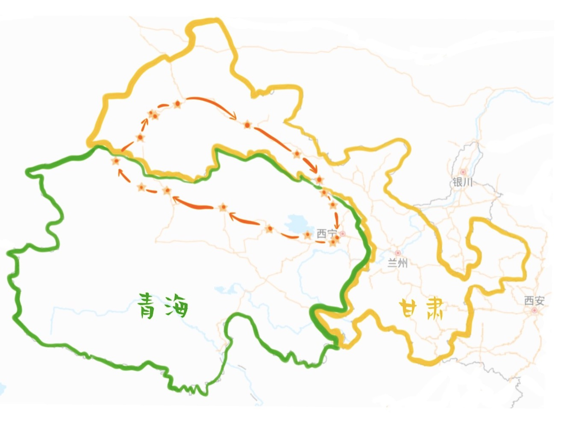
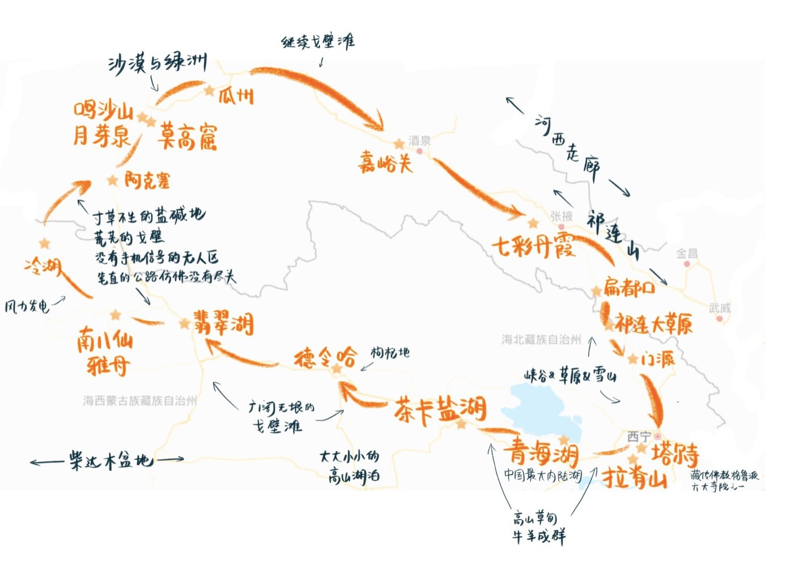
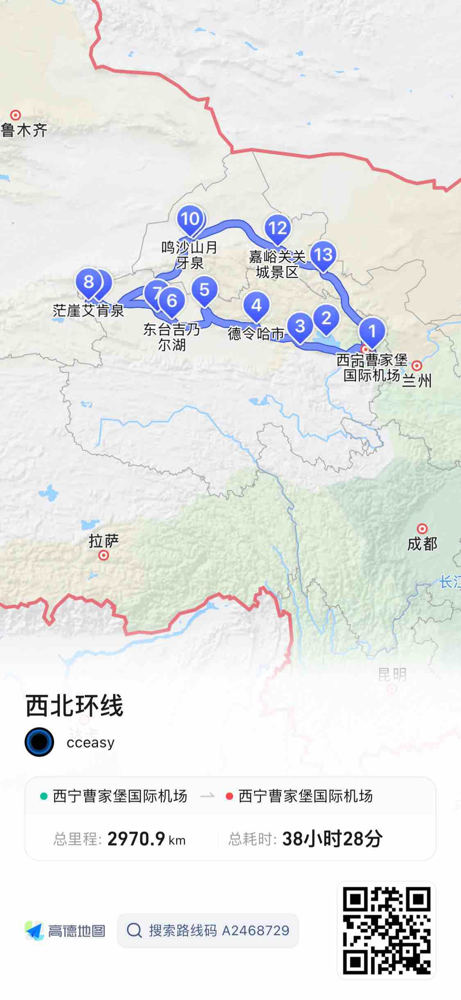

# 青海甘肃环线
总时间 8天  
总路程 3000km 左右  
按每车4人算，人均开销预计在 4000元 左右。  
  

途径西宁、青海湖、茶卡盐湖、大柴旦、东台吉乃尔、茫崖、敦煌、嘉峪关、张掖。  
放弃了可可西里地区的景点。  
  

## 行程
  
- day 0 北京 - 西宁  
> 北京出发，到达西宁，机场租车取车并住宿西宁。  
如果有时间可以去塔尔寺或者青海藏文化博物馆游览。  
住宿西宁  
- day 1 西宁 - 160km - 青海湖 - 150km - 茶卡盐湖  
> 西宁出发，沿京藏高速及109国道开车160km去往青海湖南面景区。  
下午从青海湖出发开车150km去往茶卡盐湖，日落前到达的话可以去盐湖拍照。  
然后开车200km前往德令哈。  
住宿德令哈（也可以考虑住宿茶卡镇不去德令哈）  
- day 2  德令哈 - 220km - 大柴旦翡翠湖 - 200km - 东台吉乃尔湖  
> 早上从德令哈开车220km出发去往大柴旦翡翠湖，游湖之后顺着315U形公路开车200km去往东台吉乃尔，一路雅丹地貌可赏沿途风景，傍晚到达东台吉乃尔湖，游湖拍照。  
住宿东台吉乃尔  
- day 3  东台吉乃尔 - 330km - 艾肯泉 - 60km - 茫崖翡翠湖  
> 早上出发途径西台吉乃尔湖开车330km前往茫崖艾肯泉恶魔之眼，随后60km前往茫崖翡翠湖，环湖游玩。  
住宿茫崖  
- day 4  茫崖 - 540km - 月牙泉  
> 从茫崖出发开车540km前往鸣沙山月牙泉，感受沙漠中的绿洲，山坡上看大漠日落  
住宿敦煌（也可选择鸣沙山露营，拍星河）  
- day 5  敦煌 - 380km - 嘉峪关
> 早上开车13km去游览敦煌莫高窟，然后开车380km到达嘉峪关  
住宿嘉峪关  
- day 6  嘉峪关 - 220km - 张掖  
> 开车220km前往张掖七彩丹霞  
住宿张掖  
- day 7  张掖 - 450km - 西宁 - 北京  
> 开车450km前往西宁，途径祁连山脉草原，在西宁还车休整，准备返京  

## 费用预估  
> 按每车4人算，预计人均开销 4000元  

|条目|费用|
|---|---|
|北京飞西宁|300元/人|
|西宁飞北京|500元/人|
|租车8天 宝沃BX7四驱SUV|2300元/车|
|油费|1500元/车|
|过路费|400元/车|
|住宿|1200元/人|
|吃饭|800元/人|
|景点|1000元/人|

## 美食攻略  
TODO

## 备注  
- 青海昼夜温差大，备好厚衣服
- 紫外线比较强，携带防晒装备
- 药品：感冒药、消炎、腹泻、防蚊虫、防晒
- 塔尔寺要传长袖长裤，不允许拍照
- 从东台吉乃尔湖开始步入315国道要提前加满油备好吃的
- 大柴旦翡翠湖 东台吉乃尔湖 景色绝美，顺着盐滩多往里走
- 莫高窟A类票需要提前2周买好
- 初到西宁的时候尽量避免感冒（可以避免洗头洗澡少折腾）

## Remarks  
> 青海疫情有待check，中秋之后更新最新版本，如果疫情地点少会更换相应地点或者绕路，受疫情影响地点多就取消plan。

  
